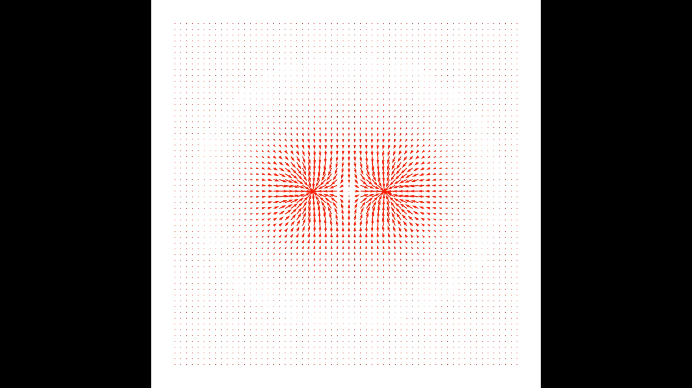
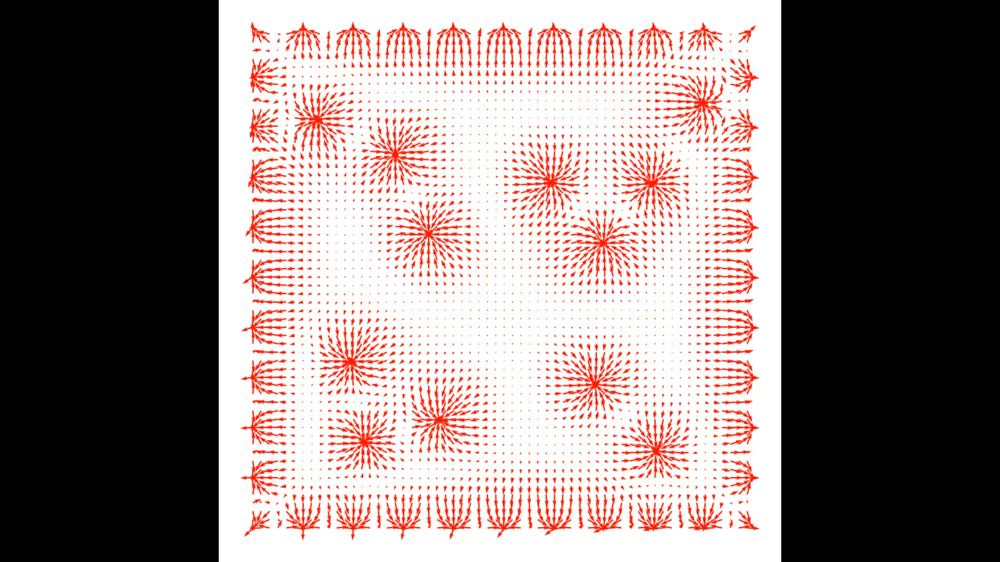
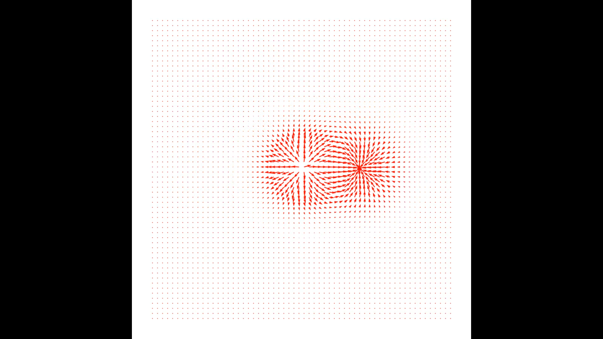

A simple program that computes the dynamic of particles and electric field for non-relativistic particles.

Each particle contributes to the total electric field, and then the force $$F=qE$$ is computed for the dynamic.
You can add particles of any mass and charge you desire, with any position and momentum.

The program works by plotting a 2D image for every iteration and saving it in a folder. At the end of the program, a video is generated from all the images using os and moviepy. 
You need to create a folder and specify the path to this folder at the beginning of the code.

**Two electrons repel each other**

**A box of electrons with free electrons inside**

**An electron orbiting a proton**

